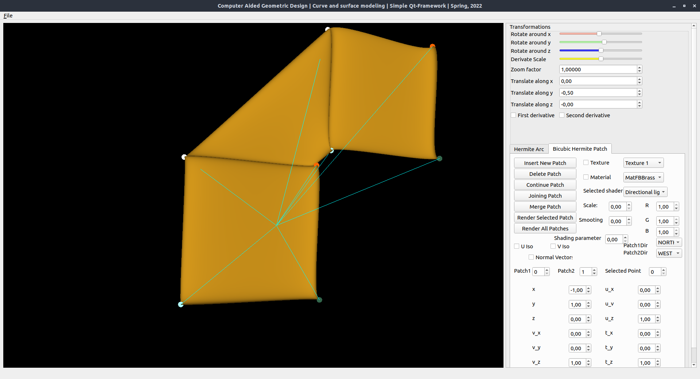

# hermite-arcs-patches

This is a university project for our Graphics class I undertook with 2 classmates, that uses technologies such as OpenGL and Qt and implements the rendering and manipulation of Cubic Hermite arcs and Bicubic Hermite patches. 
More precisely:
1. interactive rendering of an isolated arc: points, first and second
order derivatives
2. Evaluation and interactive rendering of an isolated patch: points, first order
partial derivatives, unit normal vectors, u- and v -directional isoparametric curves
3. Rendering, modifying and labeling of selected patch data (e.g. control nets,
partial derivatives, twist vectors).
4. interactive joining/merging/extension of arcs with C^1-continuity along all four direction pairs. 
5. interactive joining/merging/extension of patches with C^1-continuity in all 8 possible directions.
6. In general, updating an existing arc/patch affects neighboring arcs/patches: in case of each arc/patch use a list that stores the pointers and direction pairs of neighboring arcs/patches.

Besides the basic implementation of the rendering of the arcs and patches, I personally worked on the joining of arcs and patches and their interactivity (for example, if two patches are joined on a certain side, moving points on that side should manipulate both patches) and implemented the interface menu controls for this part as well.

